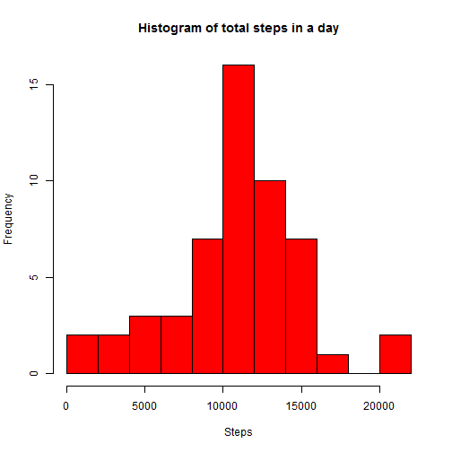
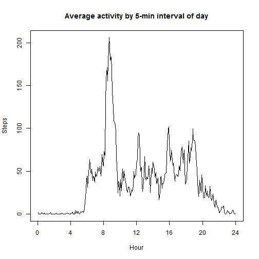
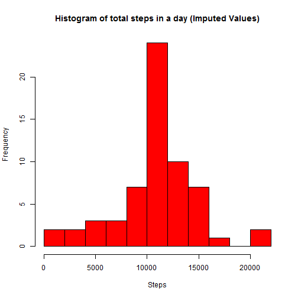

# Reproducible Research: Peer Assessment 1


## Loading and preprocessing the data

Data is loaded and preprocessed.
Ten lines of sample data are displayed below: 


```r
myData = read.csv("activity.csv")
myData[sample(dim(myData)[1], 10), ]
```

```
##       steps       date interval
## 6023      0 2012-10-21     2150
## 1501      0 2012-10-06      500
## 11302    NA 2012-11-09      545
## 4296     17 2012-10-15     2155
## 13620     0 2012-11-17      655
## 11061     0 2012-11-08      940
## 5685     38 2012-10-20     1740
## 712       0 2012-10-03     1115
## 3905      0 2012-10-14     1320
## 2499     58 2012-10-09     1610
```

  
  
## What is mean total number of steps taken per day?

The step data is factored by day. The distribution of total steps per day in the sample data is given below.


```r
myData$day = factor(substr(myData$date, 6, 10))
steps_day = aggregate(steps ~ day, myData, sum, na.rm = T)
hist(steps_day$steps, breaks = 15, col = 2, xlab = "Steps", main = "Histogram of total steps in a day")
```

 


```r
# daily mean calcd from weighted interval averages to allow for bias due to
# distribution of NA values.
mean_int = aggregate(steps ~ interval, myData, mean, na.rm = T)
count_int = aggregate(steps ~ interval, myData, function(x) {
    length(na.omit(x))
})
nints = length(unique(myData$interval))
mean_day = weighted.mean(mean_int$steps, count_int$steps) * nints

# median of data set
med_day = median(myData$steps, na.rm = T)
```


A mean of 10766 steps and 
a median of 0 steps are taken on average per day. 
  
  
## What is the average daily activity pattern?


```r
# plot time series
plot(mean_int$steps, type = "l", main = "Average activity by 5-min interval of day", 
    xaxt = "n", xlab = "Hour", ylab = "Steps")
axis(1, at = 0:6 * nints/6, labels = seq(0, 24, 4))
```

 


```r
# peak interval
peak_int_val = max(mean_int$steps)
peak_int = mean_int$interval[which(mean_int$steps == peak_int_val)]
peak_int_char = paste0(rep("0", 4 - nchar(as.character(peak_int))), peak_int, 
    collapse = "")
```


The peak interval is 0835 where an average of 206.2 steps are taken.
  

## Imputing missing values

To avoid bias in calculations on the "activity" dataset, we can account for missing values by imputing their expected values:

First, we find the number of NA values in the dataset.


```r
midx = which(!complete.cases(myData))
mrows = length(midx)
```


A total of 2304 are missing from the data. This corresponds to 8 unrecorded days.

These missing values are filled in using the corresponding 5-minute interval means of the complete cases.


```r
myData$mean_int = mean_int$steps
myData$steps = ifelse(is.na(myData$steps), myData$mean_int, myData$steps)
myData = myData[, -5]
```


```r
steps_day = aggregate(steps ~ day, myData, sum, na.rm = T)
hist(steps_day$steps, breaks = 15, col = 2, xlab = "Steps", main = "Histogram of total steps in a day (Imputed Values)")
```

 


```r
mean_day = mean(myData$steps) * nints
med_day = median(myData$steps, na.rm = T)
```


Using the imputed data, a mean of 10766 steps and 
a median of 0 steps are taken on average per day. 

With the completed dataset, all 8 days that were previously missing now have a total of 10766 steps which is the average of the initital dataset. The resulting histogram shows that 8 days have been added to the bin containing the mean. 

The mean itself has remained unchanged as has the median. Though the latter could potentially have changed.
  

## Are there differences in activity patterns between weekdays and weekends?

To determine if there is a difference in step pattern from weekday to weekend, we need to introduce a weekday/weekend factor into the dataset.


```r
myData$date = as.Date(myData$date)
myData$wd = factor(ifelse(weekdays(myData$date) %in% c("Saturday", "Sunday"), 
    "weekend", "weekday"))
```


The results of step patterns by weekday/weekend are given below. The values are given as deviations from the respective means.


```r
library(ggplot2)
mean_wd = aggregate(steps ~ wd, myData, mean)
mean_wd_int = aggregate(steps ~ wd + interval, myData, mean)
mean_wd_int$steps = (mean_wd_int$steps - mean_wd$steps)
qplot(interval, steps, data = mean_wd_int, facets = . ~ wd, geom = c("line", 
    "smooth"))
```

```
## geom_smooth: method="auto" and size of largest group is <1000, so using loess. Use 'method = x' to change the smoothing method.
## geom_smooth: method="auto" and size of largest group is <1000, so using loess. Use 'method = x' to change the smoothing method.
```

 

